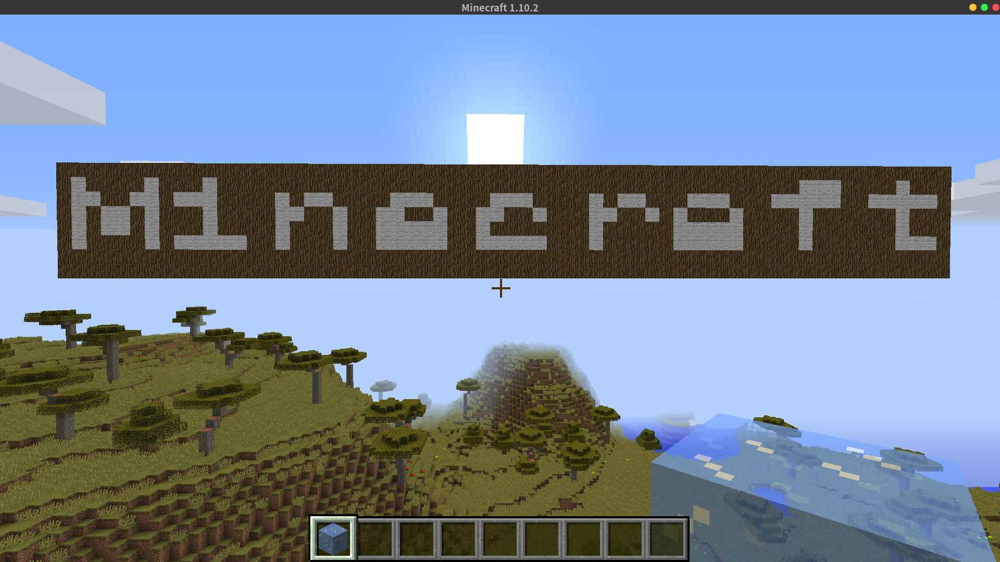

#MinecraftTypewriter
____

##description
----
	require mcpi module of python
	require RaspberryJamMod from github

##usage
----
	change the string defination of words2print
	then run the script when the game is on with RaspberryJamMod
	make sure you have installed mcpi in advance

##snapshot
----
